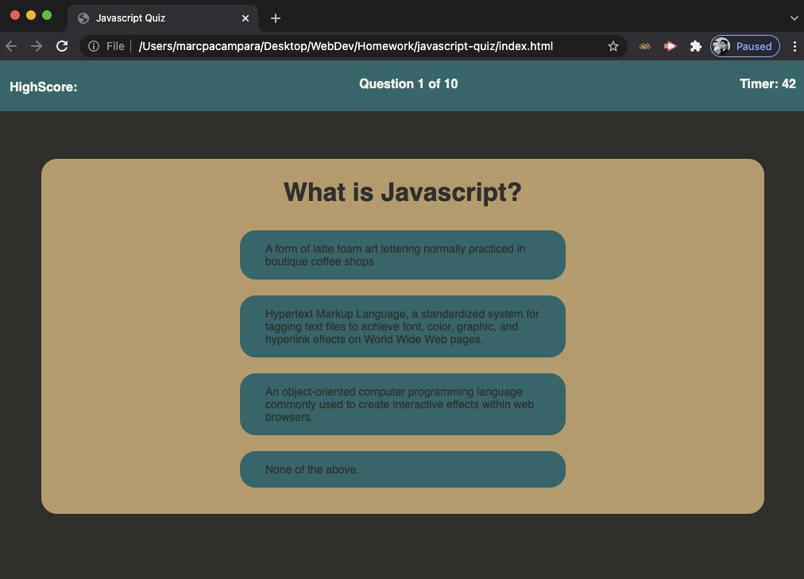

# javascript-quiz

This is a quiz on the subject about javascript.

User will have 300 seconds to answer 10 questions. 

User will gain 10 points for every questions they answer correctly.

User will lose :10 seconds for every question they answer inccorectly.

If the timer runs out, the quize will end and you will be asked to input your initials.

If you finish answering all ten questions before the time runs out, the quiz will end and you will be asked to inpt your initials.

Highscores are recorded and will be placed on the top left corner of the window.

I hope  you enjoy the quiz! Good luck!

If you would like to see the code behind this project please visit my github:
https://github.com/SnkrFr3sh/javascript-quiz

You can also visit the deployment site:
https://snkrfr3sh.github.io/javascript-quiz/